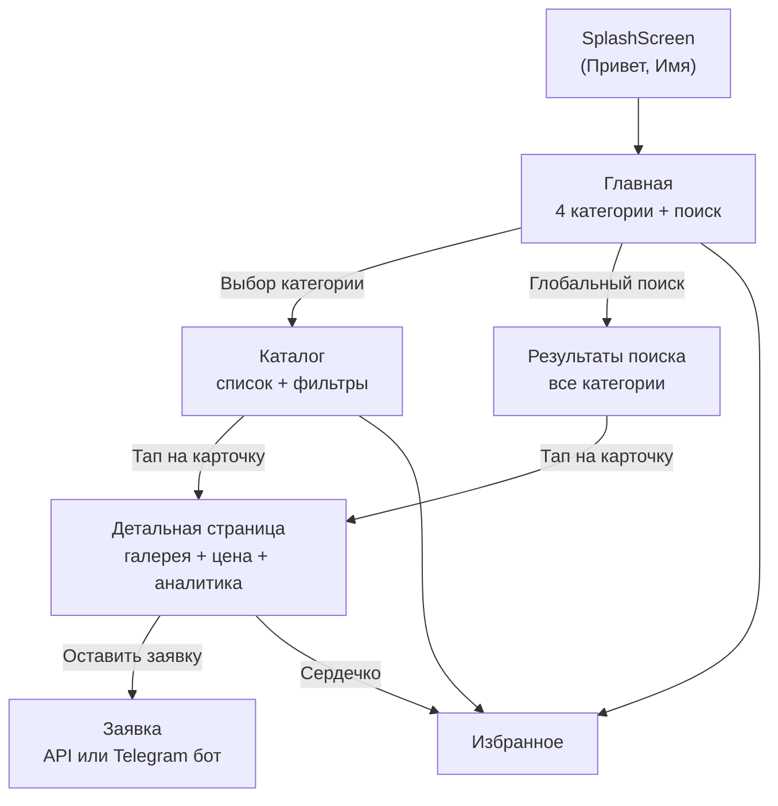

# PRD: GONKA — Telegram Mini App маркетплейс конфискованной техники

---

## 1. Суть продукта

**GONKA CONFISCATED MARKET** — мобильный маркетплейс внутри Telegram, агрегирующий конфискованную и изъятую технику от крупнейших лизинговых компаний России (ВТБ Лизинг, Европлан, Альфа-Лизинг, Газпромбанк Автолизинг) в единый каталог с поиском, фильтрацией и ценовой аналитикой.

**Проблема:** Конфискованная лизинговая техника продаётся на разрозненных сайтах лизинговых компаний. Покупатель вынужден мониторить 4+ площадки, сравнивать цены вручную, нет единого поиска и фильтрации.

**Решение:** Единая точка входа через Telegram Mini App, где все лоты агрегированы, дедуплицированы, нормализованы и доступны с фасетным поиском, фильтрацией и аналитикой рыночной цены.

---

## 2. Целевая аудитория

### 2.1. Первичная аудитория

- **Перекупщики и автодилеры** — профессиональные покупатели, которые ищут технику ниже рынка для перепродажи. Мониторят лизинговые площадки ежедневно. Для них критичны: скорость обнаружения новых лотов, аналитика цены, покрытие всех источников.

- **Малый и средний бизнес** — владельцы автопарков (грузоперевозки, строительство, сельское хозяйство). Ищут грузовую, специальную технику и прицепы по цене ниже рынка. Ценят фильтрацию по категории, типу кузова, колёсной формуле.

### 2.2. Вторичная аудитория

- **Частные покупатели** — ищут легковой автомобиль дешевле рынка. Менее опытны, им важна простота интерфейса, понятная ценовая аналитика ("ниже рынка" / "выше рынка"), удобный поиск с автоподсказками.

- **Лизинговые брокеры и агенты** — посредники, помогающие клиентам приобрести технику. Используют как инструмент мониторинга.

### 2.3. Характеристики аудитории

- **География:** Россия (города присутствия лизинговых компаний — Москва, СПб, регионы)
- **Платформа:** Telegram (высокое проникновение в целевой аудитории)
- **Паттерн использования:** регулярный мониторинг (ежедневный/еженедельный), быстрый просмотр новых лотов, фильтрация под конкретный запрос
- **Устройства:** преимущественно мобильные (Telegram Mini App)

---

## 3. Уникальное торговое предложение (УТП)

### Ключевое УТП

> Единственный агрегатор конфискованной лизинговой техники в Telegram — 4 источника, один поиск, аналитика цены.

### Составляющие УТП

1. **Агрегация 4 лизинговых компаний** — ВТБ, Европлан, Альфа-Лизинг, Газпромбанк. Покупателю не нужно мониторить каждую площадку отдельно.

2. **Интеллектуальный поиск** — транслитерация (кириллица/латиница), синонимы брендов (`шакман` = `shacman`, `камри` = `toyota camry`), пословный матч. Пользователь находит технику даже при неточном вводе.

3. **Ценовая аналитика** — визуальная шкала "ниже рынка / на уровне / выше рынка" (компонент `PriceAnalysisBar`), вычисляемая по квантилям аналогичных моделей. Покупатель сразу видит выгодность лота.

4. **Нативный опыт в Telegram** — Mini App не требует установки, работает мгновенно из чата. Персонализация через Telegram-аккаунт (приветствие по имени, избранное).

5. **Нормализация данных** — единый формат: привод, двигатель, трансмиссия, тип кузова нормализованы из разных форматов источников. Дедупликация по VIN и title+year+mileage.

6. **Фасетные фильтры** — 6 параметров (марка, кузов, привод, город, цена, пробег) с живыми счётчиками количества лотов, учитывающими все остальные активные фильтры.

---

## 4. Функциональная архитектура

### 4.1. Пользовательский путь (User Flow)



### 4.2. Информационная архитектура

- **/** — `CategorySelectionPage`: 4 категории (легковые, грузовые, спецтехника, прицепы), глобальный поиск, секция "Выгодно" (лоты со скидкой)
- **/catalog/:category** — `CatalogPage`: виртуализированный грид с поиском и фильтрами, привязка состояния к URL
- **/listing/:id** — `ListingPage`: галерея с свайпом, цена, аналитика, описание, CTA "Оставить заявку"
- **/favorites** — `FavoritesPage`: сохранённые лоты (localStorage)
- **/profile** — `ProfilePage`: аватар и имя из Telegram (в разработке)
- **/about** — `AboutPage`: описание проекта

### 4.3. Источники данных

| Источник | Домен | Категории | Особенности |
|---|---|---|---|
| ВТБ Лизинг | vtb-leasing.ru | Все 4 | JSON-LD, VIN, исторические цены |
| Европлан | europlan.ru | Легковые, грузовые | SPA, нет body_type, лоты в конец списка |
| Альфа-Лизинг | alfaleasing.ru | Все 4 | Пагинация "Показать ещё", body_type из "Подвид техники" |
| Газпромбанк | autogpbl.ru | Легковые, грузовые, прицепы | HTML-парсинг, body_type из slug/title |

Данные загружаются Puppeteer-скраперами в Supabase (Postgres), нормализуются на клиенте в `useListings` (до 10 000 лотов батчами по 1 000).

### 4.4. Ценовая аналитика

- Таблица `listing_price_analysis` в Supabase (FK к `listings`)
- Группировка по `model_key` (первые 2 слова title), вычисление квантилей (low, avg, high)
- UI: градиентная шкала зелёный-оранжевый с маркером текущей цены
- Лейблы: "Цена ниже рынка" / "Цена выше рынка"
- Фолбэк: +/-5% от текущей цены если нет данных анализа

---

## 5. Дизайн-система

### 5.1. Философия дизайна

**Apple-inspired Liquid Glass** — дизайн вдохновлён iOS/macOS эстетикой: стекломорфизм (glassmorphism) с backdrop-blur, многослойные тени, pointer-tracking блики, shimmer-анимации. Минимализм и чистота, фокус на контенте.

### 5.2. Цветовая палитра

| Роль | Цвет | HEX | Применение |
|---|---|---|---|
| **Brand (основной)** | Оранжево-красный | `#FF5C34` | CTA-кнопки, заголовок "GONKA", избранное (сердечко), ценник, фокус-кольца, бейджи скидки |
| **Brand hover** | Тёмный оранжевый | `#e5522e` | Состояние нажатия кнопки "Показать" в фильтрах |
| **Brand tint** | Светлый персиковый | `#FFE1D5` | Фон активного элемента в подсказках поиска |
| **Аналитика (low)** | Зелёный | `#2aa871` | Левый край шкалы PriceAnalysisBar (низкая цена) |
| **Текст основной** | Тёмный сланец | `#0f172a` | Заголовки, основной текст (Tailwind slate-900) |
| **Текст вторичный** | Средний сланец | slate-500/600/700 | Подписи, мета-информация |
| **Фон страницы** | Белый + радиальные градиенты | `#ffffff` | Основной фон с тёплым оранжевым пятном (top-right) и холодным синим (bottom-left) |
| **Фон акцент (синий)** | Лёгкий синий | `rgba(59,130,246,0.08)` | Радиальный градиент фона (левый нижний угол) |
| **Стекло (glass)** | Белый полупрозрачный | `rgba(255,255,255,0.82-0.52)` | Фон liquid-glass элементов |
| **Стекло (nav)** | Белый сильно прозрачный | `rgba(255,255,255,0.18)` | BottomNav, ScrollToTop |

### 5.3. Liquid Glass система

Кастомная CSS-система, реализованная в `src/index.css`:

- **`.liquid-glass`** — основной класс: многослойный полупрозрачный фон (gradient 82% -> 52% -> 64%), backdrop-blur 40px, saturate 190%, brightness 108%. Pseudo-элемент `::before` с радиальным бликом, следящим за курсором (CSS custom properties `--mx`, `--my`). Pseudo-элемент `::after` — top-edge refraction и тёплый/холодный градиенты.

- **`.liquid-glass-shimmer`** — анимированный блик, проходящий по элементу за 7 секунд (skewed gradient band).

- **`.liquid-glass-nav`** — облегчённая версия для навигации: прозрачнее (18%), blur 32px, тонкая верхняя подсветка.

- **`.liquid-glass-apple-dark`** — вариант для тёмных фонов: 30% непрозрачность, brand/blue акценты.

### 5.4. Типографика

```
Основной: -apple-system, BlinkMacSystemFont, "SF Pro Text", system-ui, "Inter", "Helvetica Neue", sans-serif
Заголовок GONKA: Helvetica, Arial, sans-serif
```

- Заголовки: clamp-адаптивные (`clamp(18px, 4.5vw, 22px)` — `clamp(28px, 8vw, 42px)`)
- Тело: `text-sm` (14px), `text-xs` (12px)
- Лейблы: 11px, 13px

### 5.5. Тени

- **Карточка:** `0 14px 45px rgba(15,23,42,0.10)` — мягкая глубокая тень
- **Brand-кнопка:** `0 4px 16px rgba(255,92,52,0.3)` — тёплое оранжевое свечение
- **Выбранный чип:** `0 2px 8px rgba(255,92,52,0.25)` — акцентная тень

### 5.6. Анимации и взаимодействия

| Паттерн | Реализация |
|---|---|
| Pointer tracking | SearchBar: CSS `--mx`, `--my` из позиции курсора -> спекулярный блик |
| Shimmer | `liquid-shimmer` 7s sweep анимация |
| Active scale | `active:scale-[0.98]`, `active:scale-90`, `active:scale-95` |
| Sliding pill | BottomNav: `translateX(${activeIndex * 76}px)` для индикатора |
| Bottom sheet | FilterPanel: `translate-y-full` -> `translate-y-0`, 300ms |
| Page enter | `page-enter` 200ms fade-in |
| Splash | `splash-reveal` + `splash-text-shimmer` + `splash-hint-enter` |
| Swipe gallery | Scroll-snap + dot indicators + lightbox |

### 5.7. Z-Index иерархия

| Слой | z-index |
|---|---|
| Sticky header | z-20 |
| BottomNav | z-50 |
| ScrollToTopButton | z-[55] |
| FilterPanel (bottom sheet) | z-[60] |
| SwipeGallery lightbox | z-[999] |
| SplashScreen | z-[9999] |

### 5.8. Layout

- Максимальная ширина контента: **680px** (центрирование)
- Карточки: максимум **560px**
- Отступы: `px-4 py-5` (16px/20px)
- Safe area: `env(safe-area-inset-bottom)` для нижней навигации
- Радиус: `rounded-xl` (чипы, кнопки), `rounded-lg` (карточки), `rounded-2xl` (секции)

---

## 6. Ключевые экраны

### 6.1. Splash Screen

Минималистичный белый экран с персонализированным приветствием ("Привет, Имя!" из Telegram). Shimmer-анимация на тексте. При медленной загрузке — подсказки ("Слабый интернет или VPN мешают", "Ещё пару секунд..."). Минимальное время отображения 1.8с.

### 6.2. Главная (CategorySelectionPage)

Логотип "GONKA MARKETPLACE" (brand-цвет). Поисковая строка с liquid-glass эффектом и pointer-tracking бликом. 4 категории в виде карточек (грузовые — акцентная). Секция "Выгодно" с лотами со скидкой. При активном поиске/фильтрах — виртуализированный грид результатов.

### 6.3. Каталог (CatalogPage)

Sticky header с кнопкой "Назад". Поисковая строка + кнопка фильтров с бейджем количества активных фильтров. Виртуализированный грид (активируется при > 15 лотов). Skeleton-лоадер при загрузке.

### 6.4. Детальная страница (ListingPage)

Swipe-галерея с dot-индикаторами и lightbox. Заголовок + кнопка избранного. Блок цены (с перечёркнутой оригинальной при скидке). Год/пробег/город. PriceAnalysisBar (зелёный -> оранжевый градиент). Описание. CTA "Оставить заявку".

### 6.5. Фильтры (FilterPanel)

iOS-style bottom sheet через `createPortal`. Чипы для категориальных фильтров (марка, кузов, привод, город) с фасетными счётчиками. Range-инпуты для цены и пробега. Кнопка "Показать N лотов" и "Сбросить".

---

## 7. Технические решения

| Аспект | Решение | Обоснование |
|---|---|---|
| Платформа | Telegram Mini App | Максимальный охват целевой аудитории, zero-install |
| Frontend | React 19 + TypeScript 5.9 + Vite 7 | Современный стек, быстрая сборка, strict types |
| Стилизация | Tailwind CSS 3 | Utility-first, быстрая итерация дизайна |
| Виртуализация | @tanstack/react-virtual (useWindowVirtualizer) | Плавный скролл при 10 000+ лотов |
| БД | Supabase (Postgres) | Managed, real-time capabilities, REST API |
| Скраперы | Puppeteer + puppeteer-extra-plugin-stealth | Обход anti-bot защит лизинговых сайтов |
| Деплой | Vercel (SPA) | CDN, edge network, простой CI/CD |
| Состояние URL | react-router-dom + URL search params | Deep linking, share-ability фильтров и поиска |
| Избранное | localStorage | Работает без авторизации, мгновенный отклик |

---

## 8. Метрики успеха (предлагаемые)

- **MAU** — ежемесячная активная аудитория в Mini App
- **Conversion to Lead** — % пользователей, оставивших заявку от общего числа просмотров лотов
- **Search-to-View** — конверсия из поиска в просмотр детальной страницы
- **Filter Usage Rate** — % сессий с использованием фильтров
- **Favorites Rate** — % пользователей, добавляющих лоты в избранное
- **Return Rate** — доля возвращающихся пользователей (еженедельно)
- **Time to First Meaningful Interaction** — от открытия Mini App до первого поискового запроса или выбора категории
- **Source Coverage** — полнота покрытия лотов по каждому источнику

---

## 9. Конкурентные преимущества

1. **Нет прямых аналогов** — агрегаторов конфискованной лизинговой техники в формате Telegram Mini App не существует
2. **Нулевой порог входа** — не нужна установка приложения, регистрация, ввод данных
3. **Premium UX** — дизайн уровня Apple (liquid glass, pointer tracking) в контексте рынка, где конкуренты — устаревшие сайты лизинговых компаний
4. **Ценовая аналитика** — ни один источник не предоставляет сравнение цены лота с рынком
5. **Единый поиск с синонимами** — толерантность к ошибкам ввода, транслитерации, вариантам написания брендов
